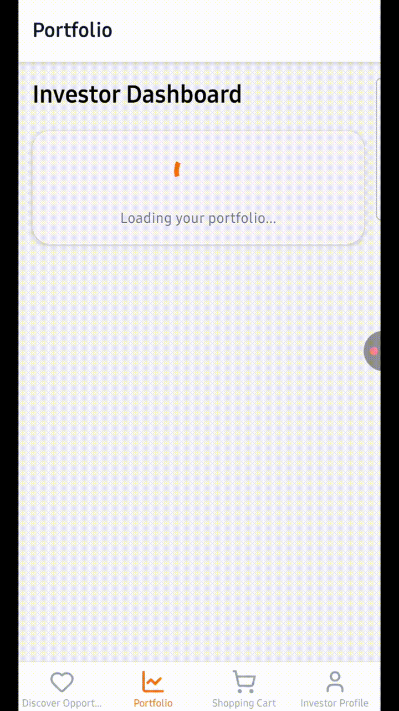

# Bitcoin University — Investor Mobile Mobile App

A React Native (Expo) mobile app for Bitcoin University — Investor, a demo investor / NFT research DAO marketplace app. This repo contains the mobile client for the Bitcoin University - Investor project. The app is built with Expo and React Native, uses React Navigation, React Query, and a small on-device wallet/solana integration.

## Demo


Below is a small GIF preview intended for the README. The repository does not contain the generated GIF by default to avoid large diffs. You can generate it locally and then commit it to `mobile/assets/demo-preview.gif`.




To generate the GIF locally (requires curl, ffmpeg, and optionally gifsicle), run the helper script included in `mobile/scripts`:

```bash
cd mobile
chmod +x scripts/generate_gif.sh
./scripts/generate_gif.sh
# then, if you want the GIF tracked in Git:
git add assets/demo-preview.gif
git commit -m "Add demo preview GIF"
```

Notes:
- The script downloads the demo MP4 from Storj and produces a short optimized GIF. It extracts a 4-second clip by default — you can edit the script to change start time and duration.
- If you don't have `gifsicle`, the script will still produce a GIF using `ffmpeg`, but `gifsicle` improves file size and optimization.

## Quick overview

- Framework: Expo (SDK 54)
- React Native: 0.81
- Entry: `index.ts` → `App.tsx`
- Navigation: React Navigation (native-stack + bottom-tabs)
- State & data: `@tanstack/react-query`, local contexts (shopping cart, toast), and on-device wallet providers

Key screens (in `src/screens`):
- Discover (SwipeInvesting)
- Portfolio (InvestorDashboard)
- Cart (ShoppingCart)
- Profile (InvestorProfile)
- Wallet onboarding & Test Wallet screens

## Setup (local)

Prerequisites:
- Node.js (16+ recommended)
- npm or yarn
- Expo CLI (optional, install with `npm i -g expo-cli`)

Install dependencies from the `mobile` folder:

```bash
cd mobile
npm install
```

Start the Expo dev tools:

```bash
npm start
# or
expo start
```

You can run on a simulator/emulator or a physical device using Expo Go. For a native build, the project has Android/iOS run scripts defined in `package.json` (`npm run android` / `npm run ios`).

## Building native binaries

The repo contains an Android AAB binary at `mobile/build-1760711902871.aab` which you can use to test a production install on Android devices or upload to the Play Console.

To produce fresh native builds, use EAS (Expo Application Services) or run the native commands via the Expo CLI. See `eas.json` and `app.json` for configuration.

## Notes & developer tips

- This project uses path aliases (see `tsconfig.json`) so editors should respect the project's TypeScript settings. If you see import errors, ensure your editor/IDE is configured for the workspace.
- The app uses `patch-package` in postinstall; if you modify `node_modules` and need to persist patches, consult `patches/` and `patch-package` docs.
- If video playback is blocked on GitHub, download the MP4 and play locally or open the raw link in a browser.

## Troubleshooting

- Metro bundler issues: clear cache with `expo start -c`.
- iOS build errors: ensure you have the matching Xcode/SDK, or use EAS build.
- Android emulator issues: ensure Android SDK and an emulator are installed; `npm run android` runs `expo run:android`.

## Credits

Authored by the Bitcoin University team. Mobile client maintained in this monorepo under `/mobile`.

---
